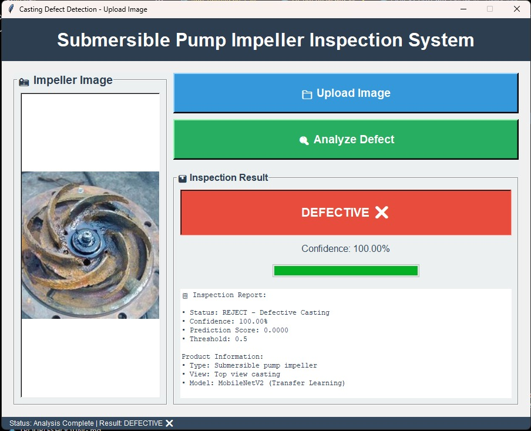
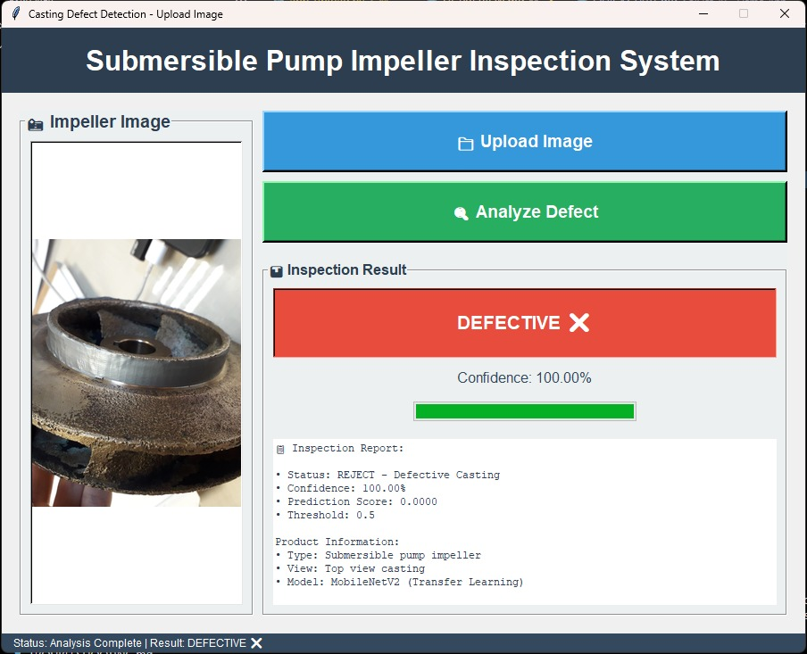
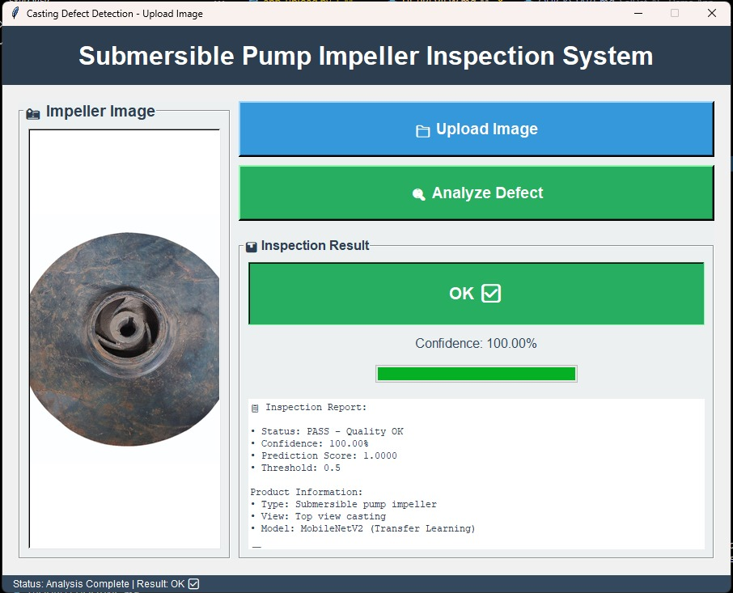
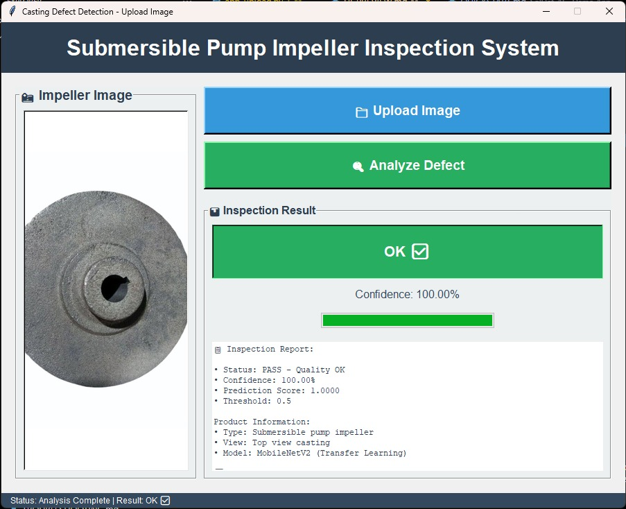
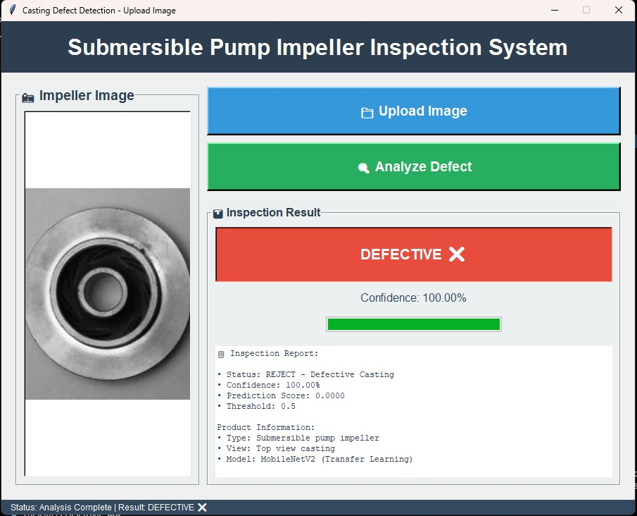
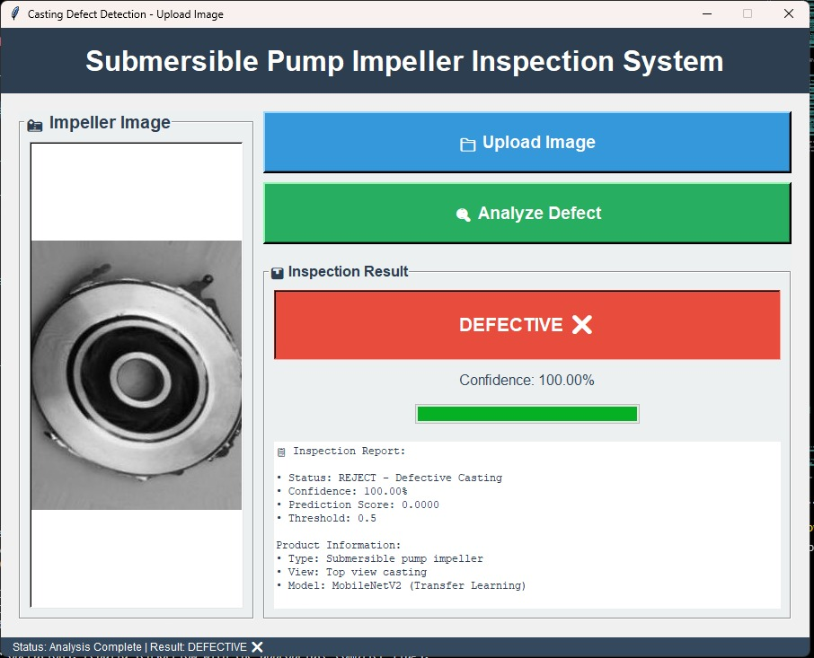
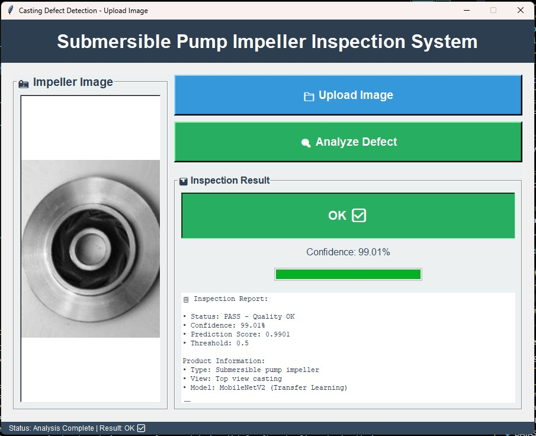
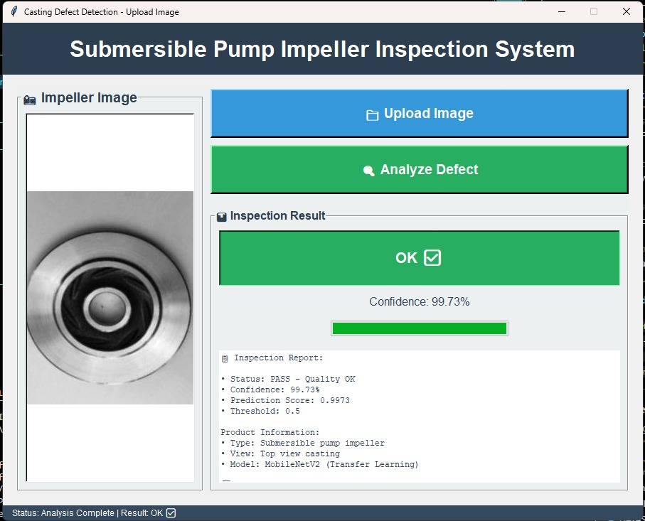

# 🔍 Casting Product Defect Detection with AI

Sistem deteksi cacat produksi casting (submersible pump impeller) menggunakan TensorFlow dan MobileNetV2 untuk quality control otomatis.

---

## 🚀 Quick Start

### 1. Setup Environment

```powershell
# Clone atau download project ini
cd "d:\Flutter Interesting Thing\SolDef_AI PCB dataset for defect detection\SolDef_AI"

# Jalankan setup otomatis
.\setup.bat

# Atau manual:
python -m venv .venv
.venv\Scripts\activate
pip install -r requirements.txt
```

### 2. Persiapkan Dataset

Struktur folder dataset:
```
dataset/
├── def_front/      # Gambar produk cacat
│   ├── cast_def_0_0.jpeg
│   ├── cast_def_0_1.jpeg
│   └── ...
└── ok_front/       # Gambar produk lulus QC
    ├── cast_ok_0_0.jpeg
    ├── cast_ok_0_1.jpeg
    └── ...
```

Dataset sudah tersedia di folder `dataset/`.

### 3. Training Model

**Opsi 1 - Menggunakan BAT file:**
```powershell
.\train.bat
```

**Opsi 2 - Manual:**
```powershell
.venv\Scripts\activate
python train.py
```

**Opsi 3 - Jupyter Notebook:**
```powershell
jupyter notebook train.ipynb
```

---

## 📊 Model Architecture

- **Base Model:** MobileNetV2 (pre-trained ImageNet)
- **Input Size:** 224x224 RGB
- **Output:** Binary classification (Defective vs OK)
- **Optimizer:** Adam (lr=0.001)
- **Loss:** Binary Crossentropy
- **Use Case:** Casting defect detection (submersible pump impeller inspection)

**Custom Head:**
```
GlobalAveragePooling2D → Dense(128) → Dropout(0.3) → Dense(1, sigmoid)
```

---

## ⚙️ Configuration

Default training parameters:
```python
IMG_SIZE = (224, 224)      # Input image size
BATCH_SIZE = 16            # Images per batch
EPOCHS = 200               # Training iterations
LEARNING_RATE = 0.001      # Adam optimizer learning rate
DROPOUT_RATE = 0.3         # Dropout for regularization
DENSE_UNITS = 128          # Dense layer neurons
```

**Untuk tweaking parameter lebih lanjut, baca:** [CONFIGURATION.md](CONFIGURATION.md)

---

## 📈 Expected Results

Dengan RTX 3080 Ti (11GB VRAM):
- **Training Time:** ~20-25 menit (200 epochs)
- **Target Accuracy:** ≥ 90%
- **Model Size:** ~9-10 MB (.h5 format)

**Sample Output:**
```
Epoch 200/200
342/342 [==============================] - 6s 18ms/step
loss: 0.1234 - accuracy: 0.9523 - val_loss: 0.1876 - val_accuracy: 0.9176

✅ Training Complete!
Final Training Accuracy:    95.23%
Final Validation Accuracy:  91.76%
Model saved: qc_inspector_model.h5
```

---

## 🎯 Actual Training Results

Model ini telah berhasil ditraining dengan hasil yang sangat memuaskan! Berikut dokumentasi hasil training:

### Training Setup & Progress
<div align="center">


</div>

### Training Metrics & Results
<div align="center">


</div>

### Final Accuracy & Model Evaluation
<div align="center">


</div>

### 🖥️ Demo Application (Casting Defect Detection UI)

Aplikasi GUI telah berhasil dibuat untuk inspeksi kualitas produk casting:

<div align="center">


</div>

**Fitur Aplikasi:**
- 📁 Upload image untuk analisis
- 🔍 Automatic defect detection
- 📊 Detailed inspection report dengan confidence score
- ✅ Result: **OK** dengan confidence **99.73%**
- 📋 Product information (Type: Submersible pump impeller)
- 🤖 Model: MobileNetV2 (Transfer Learning)

**Hasil Deteksi:**
- Status: **PASS - Quality OK ✅**
- Confidence: **99.73%**
- Prediction Score: **0.9973**
- Threshold: **0.5**

---

## 📁 Output Files

Setelah training selesai:
```
✅ qc_inspector_model.h5        # Model final untuk deployment
✅ best_model.h5                # Backup model terbaik
✅ training_history.json        # Training metrics
✅ logs/                        # TensorBoard logs
✅ checkpoints/                 # Model checkpoints per epoch
```

---

## 🧪 Testing Model

```python
import tensorflow as tf
from tensorflow.keras.preprocessing import image
import numpy as np

# Load model
model = tf.keras.models.load_model('qc_inspector_model.h5')

# Load image (impeller casting - top view)
img_path = 'test_impeller.jpg'
img = image.load_img(img_path, target_size=(224, 224))
img_array = image.img_to_array(img) / 255.0
img_array = np.expand_dims(img_array, axis=0)

# Predict
prediction = model.predict(img_array)
result = "DEFECTIVE ❌" if prediction[0][0] < 0.5 else "OK ✅"
confidence = (1 - prediction[0][0]) * 100 if prediction[0][0] < 0.5 else prediction[0][0] * 100

print(f"Impeller Status: {result} (Confidence: {confidence:.2f}%)")
```

---

## 🎯 Demo Applications

**2 versi demo app Python dengan GUI sudah tersedia di folder `Demo App/`:**

### 1️⃣ Upload Image Version (`app_upload.py`)
- 📁 Upload gambar impeller dan analisis
- 📊 Detailed inspection report dengan confidence score
- 🎨 Beautiful GUI dengan Tkinter
- ✅ Best for: Batch processing, archive images

### 2️⃣ Real-time Camera Version (`app_realtime.py`)
- 📹 Live detection via webcam/camera
- 🎥 Real-time overlay dan FPS counter
- 📸 Capture frame dengan hasil prediksi
- ✅ Best for: Live inspection, QC production line

**Quick Start:**
```powershell
cd "Demo App"
# Double-click: DEMO_LAUNCHER.bat
# Atau manual:
python app_upload.py      # Upload version
python app_realtime.py    # Real-time version
```

**Dokumentasi lengkap:** [Demo App/README.md](Demo%20App/README.md)

---

## 📚 Documentation

- 📖 [QUICKSTART.md](QUICKSTART.md) - Panduan cepat untuk pemula
- ⚙️ [CONFIGURATION.md](CONFIGURATION.md) - Tweaking parameters training
- 🔧 [TROUBLESHOOTING.md](TROUBLESHOOTING.md) - Solusi masalah umum
- 💻 [WINDOWS_SETUP.md](WINDOWS_SETUP.md) - Setup CUDA & cuDNN di Windows
- 📊 [DATASET.md](DATASET.md) - Informasi dataset
- 🚀 [DEPLOYMENT.md](DEPLOYMENT.md) - Deploy ke production

---

## 🛠️ Requirements

### Hardware
- **CPU:** Intel/AMD (multi-core recommended)
- **RAM:** 8GB minimum, 16GB recommended
- **GPU:** NVIDIA GPU dengan CUDA support (RTX 3080 Ti recommended)
- **Storage:** 5GB free space

### Software
- **OS:** Windows 10/11 64-bit
- **Python:** 3.9.x
- **CUDA:** 11.2
- **cuDNN:** 8.1
- **TensorFlow:** 2.10.0

**Full installation guide:** [WINDOWS_SETUP.md](WINDOWS_SETUP.md)

---

## 📦 Dependencies

```txt
tensorflow==2.10.0
numpy>=1.21.0
matplotlib>=3.5.0
pillow>=9.0.0
```

Install semua:
```bash
pip install -r requirements.txt
```

---

## 🎯 Performance Tips

**1. Untuk training lebih cepat:**
```python
BATCH_SIZE = 32  # Naikan batch size
```

**2. Untuk accuracy lebih tinggi:**
```python
EPOCHS = 300     # Tambah epochs
DENSE_UNITS = 256  # Perbesar model complexity
```

**3. Untuk cegah overfitting:**
```python
DROPOUT_RATE = 0.5  # Naikan dropout
# Tambah data augmentation (lihat CONFIGURATION.md)
```

---

## 📊 Dataset Info

- **Product Type:** Submersible pump impeller (casting manufacturing)
- **Total Images:** 1,016 images
  - **def_front:** 453 images (defective casting)
  - **ok_front:** 563 images (OK/pass casting)
- **Image Size:** 512x512 pixels (auto-resized ke 224x224)
- **Format:** JPEG (grayscale converted to RGB)
- **View:** Top view of impeller
- **Split:** 80% training, 20% validation (auto)

**Sumber:** Real-life Industrial Dataset of Casting Product (Kaggle)  
**Credit:** PILOT TECHNOCAST, Shapar, Rajkot

---

## 🔥 Features

✅ **Transfer Learning** dengan MobileNetV2 (pre-trained)  
✅ **Data Augmentation** otomatis (rotation, zoom, flip)  
✅ **Early Stopping** untuk cegah overfitting  
✅ **Learning Rate Reduction** otomatis  
✅ **Model Checkpoint** simpan model terbaik  
✅ **TensorBoard** untuk visualisasi training  
✅ **GPU Acceleration** dengan CUDA 11.2  
✅ **Progress Bar** dengan metrics real-time  

---

## 🐛 Troubleshooting

**GPU tidak terdeteksi?**
```python
import tensorflow as tf
print(tf.config.list_physical_devices('GPU'))
# Output: [PhysicalDevice(name='/physical_device:GPU:0', device_type='GPU')]
```

**Out of Memory?**
```python
BATCH_SIZE = 8  # Turunkan batch size
```

**Training terlalu lambat?**
- Pastikan GPU digunakan (`nvidia-smi`)
- Naikan batch size
- Reduce model complexity

**Lihat solusi lengkap:** [TROUBLESHOOTING.md](TROUBLESHOOTING.md)

---

## 📞 Support

- **Issues:** Buka issue di GitHub repository
- **Documentation:** Lihat folder docs/ untuk panduan lengkap
- **TensorFlow Forum:** https://discuss.tensorflow.org/

---

## 📝 License

MIT License - Free to use for educational and commercial purposes.

---

## 🙏 Acknowledgments

- **Dataset:** Real-life Industrial Dataset of Casting Product
- **Source:** [Kaggle - Ravirajsinh Dabhi](https://www.kaggle.com/datasets/ravirajsinh45/real-life-industrial-dataset-of-casting-product)
- **Company:** PILOT TECHNOCAST, Shapar, Rajkot
- **Base Model:** MobileNetV2 (ImageNet pre-trained)
- **Framework:** TensorFlow 2.10.0

**About the Dataset:**
This dataset contains images of casting manufacturing products (submersible pump impeller).
Casting defects include blow holes, pinholes, burr, shrinkage defects, mould material defects, pouring metal defects, and metallurgical defects.
The images are top-view of impellers captured with stable lighting arrangement.

---

**Ready to train? Run:** `.\setup.bat` **then** `.\train.bat`

Good luck! 🚀
